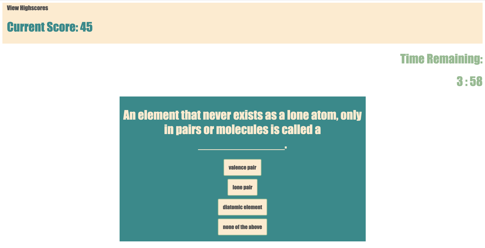
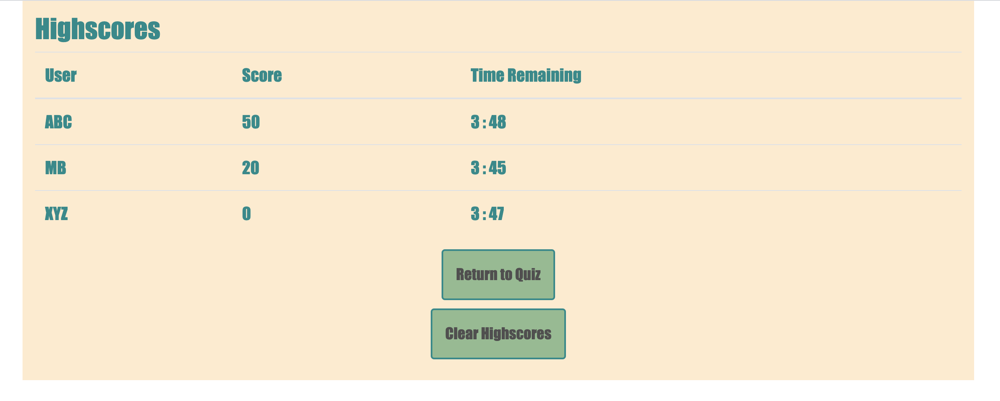

# CodeQuiz
#### This is the repository for Homework 4, due December 5th, 2020.

### For this assignment, I have created 2 HTML files, a CSS file, and a JavaScript file. Using these, I have developed a quiz that users can take to test their knowledge of a subject.
    * This quiz is on basic Chemistry. My previous work experience is as an educator, most recently teaching High School Physics and Chemistry. Creating quizzes is in my wheelhouse, but never previously in this capacity. 
    * The user can navigate between the main quiz page and the page containing highscores. 
        * The highscore list will only be populated with information contained in local storage. If desired, the user may clear the highscores list. The highscores contain a user name, score, and the time remaining when the quiz was completed.
    * The user has 5 minutes to complete the quiz, if they run out of time the quiz will be ended, and their points totalled. "Ran out of time" will be recorded as their remaining time. 
    * If an incorrect answer is entered, the user will be notified that they have lost 5 seconds from the timer. The correct answer is not displayed, so that the user can try to figure it out themselves on future attempts. 
    * When the user completes all 10 questions, they will be able to enter their initials, and be added to the highscores page.
        *They will then automatically be navigated back to the front page where they can either navigate to the highscore page, or try the quiz again. 
    
### [Code Quiz](https://meganbryan.github.io/CodeQuiz/)
### 
### 
### 
